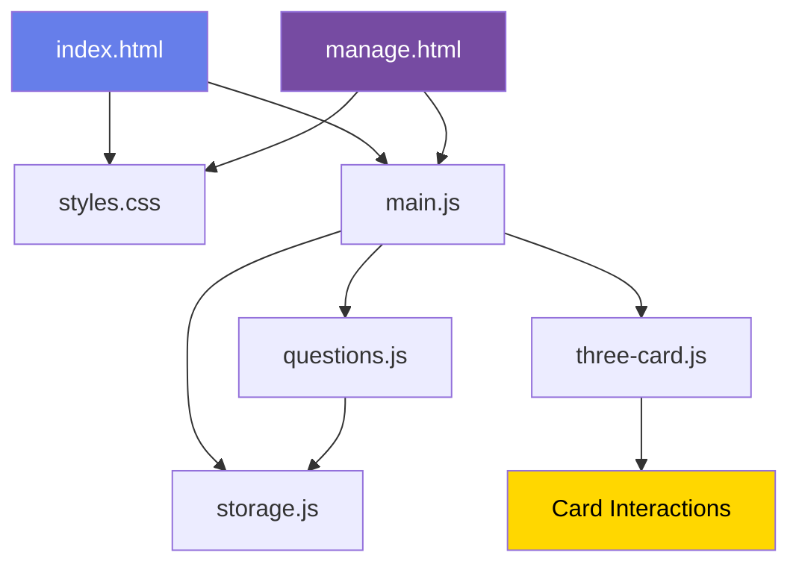
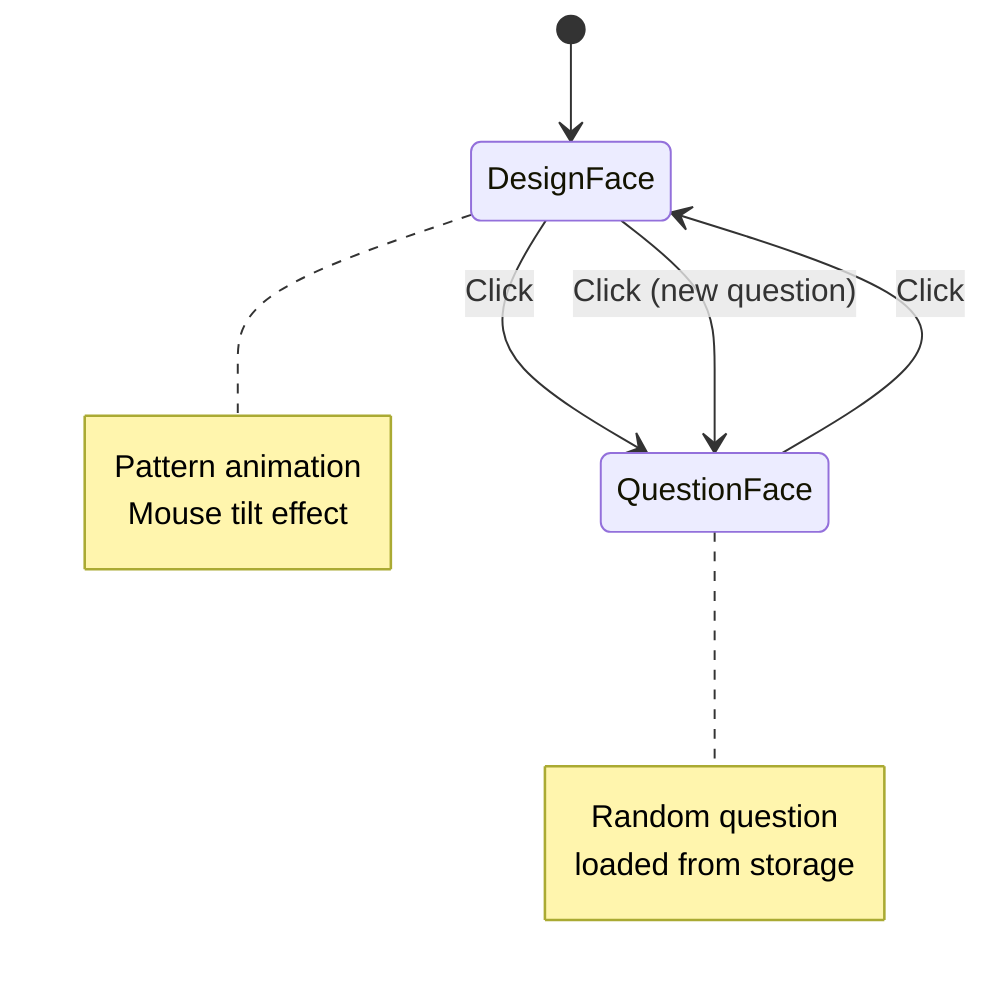
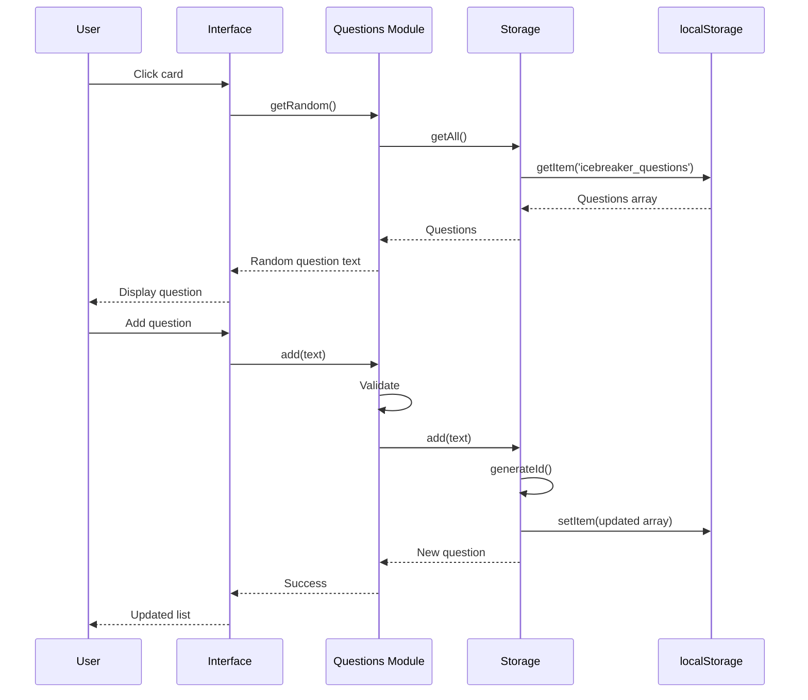
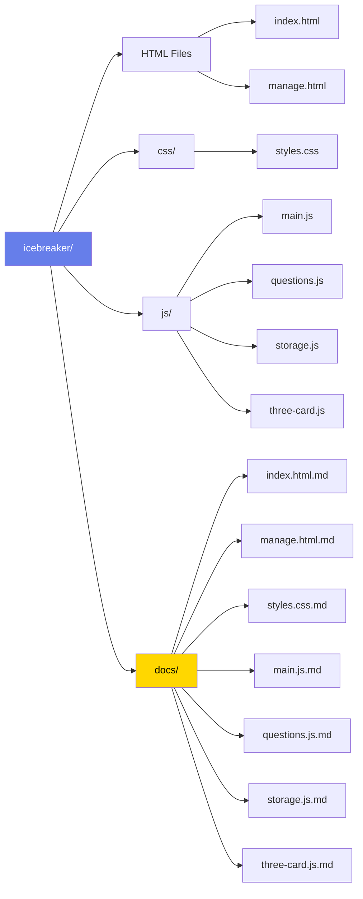

# IceBreaker - Interactive Question Card

A minimalist web application with a single 3D card that displays reflection questions. Click the card to flip and discover new questions.


---

## Features

- **Single 3D Card** - Smooth flip animation with Three.js
- **Custom Card Design** - Uses custom image on front, solid color on back
- **Mouse Tilt Effect** - Card tilts up/down following mouse movement
- **Question Management** - Add, view, and delete custom questions
- **Local Storage** - All questions persist in browser storage
- **Responsive Design** - Works on desktop, tablet, and mobile
- **Wood Background** - Beautiful wood texture background image

---

## Installation

No build process required! Simply:

1. Clone or download this repository
2. Open `index.html` in your browser

Or use a local server:
```bash
# With Python 3
python -m http.server 8000

# With Node.js
npx serve

# Then visit http://localhost:8000
```

---

## File Structure

```
icebreaker/
│── index.html          # Main app - card viewing
│── manage.html         # Question management interface
│── /css
│   └── styles.css      # All styles (glassmorphism, animations)
│── /js
│   ├── main.js         # App initialization
│   ├── questions.js    # Question data & operations
│   ├── storage.js      # localStorage wrapper
│   └── three-card.js   # Card tilt & flip effects
│── /assets             # Custom images
│   ├── backgrounds/    # Website background images
│   ├── card-faces/     # Card texture images
│   └── README.md       # Assets guide
│── /docs               # Individual file documentation
│   ├── index.html.md
│   ├── manage.html.md
│   ├── styles.css.md
│   ├── main.js.md
│   ├── questions.js.md
│   ├── storage.js.md
│   └── three-card.js.md
│── README.md           # This file
```

---

## How It Works

### Using the Card

1. Open `index.html`
2. Hover over the card to see the tilt effect
3. Click the card to flip and reveal a question
4. Click again to flip back to the design face
5. Click again to see a new random question

### Managing Questions

1. Open `manage.html` or click "Manage Questions" (if added)
2. Type a question in the input field
3. Click "Add Question" or press Enter
4. Click "Delete" to remove questions (with confirmation)

---

## localStorage

**Storage Key:** `icebreaker_questions`

**Data Structure:**
```javascript
[
  { id: "q_1699123456789_abc123", text: "What's something you learned today?" },
  { id: "q_1699123456790_def456", text: "What would you do if you weren't afraid?" }
]
```

**First Load:** 10 default questions are automatically loaded.

**Clear Data:** Open browser DevTools → Console → type:
```javascript
localStorage.removeItem('icebreaker_questions');
```

---

## Mermaid Diagrams

### System Architecture



### User Interaction Flow



### Question Data Flow



### Folder Structure Graph



---

## Technologies Used

| Technology | Purpose | Version |
|------------|---------|---------|
| HTML5 | Structure | - |
| CSS3 | Styling & Animations | - |
| JavaScript (ES6+) | Logic | Modules |
| localStorage | Data Persistence | Web API |
| Three.js | 3D card rendering | r128 (CDN) |

---

## Browser Support

| Browser | Version |
|---------|---------|
| Chrome/Edge | ✅ Full Support |
| Firefox | ✅ Full Support |
| Safari | ✅ Full Support* |

*Safari requires `-webkit-` prefix for `backdrop-filter` (included)

---

## Future Improvements

- [ ] Dark/light mode toggle
- [ ] Sound effect on flip
- [ ] Categories/tags for questions
- [ ] Export/import questions as JSON
- [ ] Keyboard shortcuts
- [ ] Multiple card designs/themes
- [ ] Share question feature
- [ ] Question history
- [ ] PWA support (offline mode)

---

## Screenshots

<!-- Add screenshots here -->
*Home page with interactive card*
*Manage questions interface*

---

## License

MIT License - feel free to use this project for any purpose.

---

## Credits

Created with ❤️ using vanilla JavaScript and CSS.
